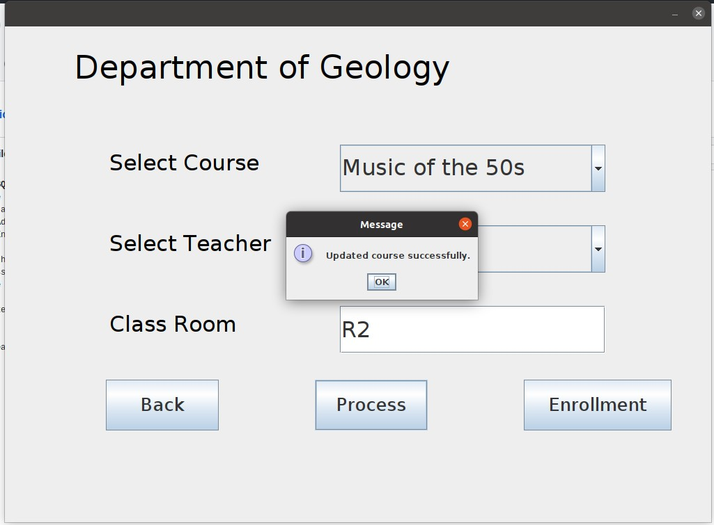

# SQL_Application
This application requires java runtime environment 16.

The application assumes that a connection to a SQL DBMS can be made at localhost:3306.
An application which uses an SQL database (database = academic_insti), which can be used to 
- Add courses, under a department, by selecting a professor and a classroom
- Enroll students, using their roll numbers, under the added courses. Introduce a new grade 'P' that stands for pending grade. 

For the year 2006, even semester, for a particular department selected by the user.

Both the operations are done only after checking the validity of the input. Invalid input results in appropriate error 
messages being displayed.
The application can be run with 
```
make run
```

Please find below a few snippets of the app in execution. 

  
   
  
  
  
  
  
  
